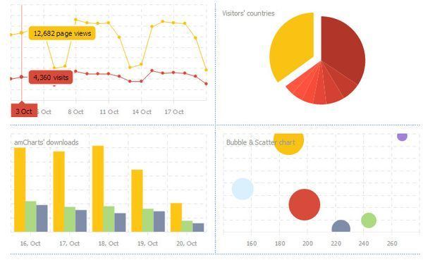
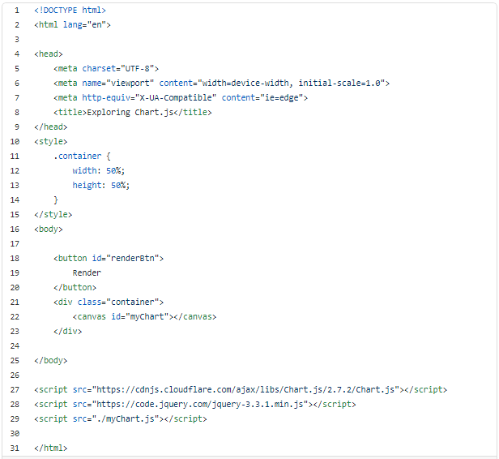
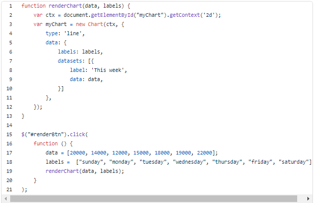
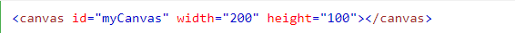

# Chart.js, Canvas

## Chart.js

*Charts.js is a library for JavaScript which uses HTMLs canvas to render various different beautiful charts for the web.*

**Creating a Chart**

>It's easy to get started with Chart.js. All that's required is the script included in your page along with a single < canvas> node to render the chart.

**Let’s start with the index.html**

**And myChart.js**

You Can :
- Drawing a line chart
- Drawing a pie chart
- Drawing a bar chart

## Canvas

**What is HTML Canvas?**

- The HTML < canvas> element is used to draw graphics, on the fly, via scripting (usually JavaScript).

- The < canvas> element is only a container for graphics. You must use a script to actually draw the graphics.

- Canvas has several methods for drawing paths, boxes, circles, text, and adding images.

**Canvs Info**

>**HTML Canvas Can Draw Text**
- Canvas can draw colorful text, with or without animation.

>**HTML Canvas Can Draw Graphics**
- Canvas has great features for graphical data presentation with an imagery of graphs and charts.

>**HTML Canvas Can be Animated**
- Canvas objects can move. Everything is possible: from simple bouncing balls to complex animations.

>**HTML Canvas Can be Interactive**
- Canvas can respond to JavaScript events.
- Canvas can respond to any user action (key clicks, mouse clicks, button clicks, finger movement).

>**HTML Canvas Can be Used in Games**
- Canvas' methods for animations, offer a lot of possibilities for HTML gaming applications.

**Canvas Example**

